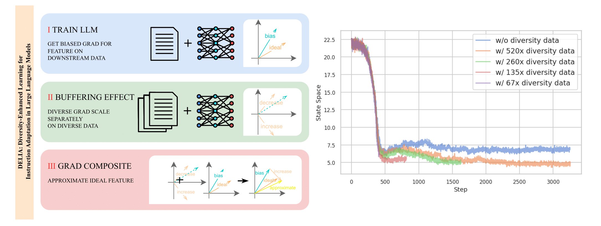

# DELIA: Diversity-Enhanced Learning for Instruction Adaptation in Large Language Models

Code for [Diversity-Enhanced Learning for Instruction Adaptation in Large Language Models](https://arxiv.org/abs/2408.10841)

**Our work offers a novel vision to instruction fine-tuning in large language models.**

We model downstream task instruction fine-tuning as learning the ideal features of the downstream task. **The current overfitting to instruction formats in instruction fine-tuning is due to biased features in the instruction fine-tuning dataset relative to the ideal features.** Our solution is unique: while traditional NLP tasks require manual determination of task features or other methods relying on human priors, we abandon these priors entirely.

**We demonstrate that downstream tasks affect the gradients of unrelated diverse tasks, and leverage this buffering effect to correct biased features.** Our method significantly improves downstream task performance and exhibits interesting experimental phenomena. Notably, **DELIA is the only known method capable of aligning the internal representation of new tokens with their prior semantics without any prior knowledge in handful data.** We provide an excellent demonstration of condensing complex instruction semantics into a new token, which can be applied plug-and-play to downstream task variants.



**Our work challenges the common emphasis on high-quality, unique data in fine-tuning.** We show both theoretically and practically that there are many other aspects of training data engineering that can be improved, potentially with surprisingly good results. **Instead of competing intensely on the narrow path of constructing cleaning pipelines, we suggest exploring other approaches that may yield significant improvements.**

Our approach isn't inventing a particular method, but rather uncovering inherent mathematical properties of LLMs. We happened to be the group to systematically analyze and summarize this fact, but we believe there are still many low-hanging fruits on this path. **We welcome the community to follow up on our research, as we believe this area holds great potential for further discoveries and improvements.**

# Quick Start

To experience DELIA with Python 3, clone our repo:
```
git clone https://github.com/LinesHogan/DELIA.git
```
Set the current directory to DELIA:
```
cd DELIA
```
You can quickly experience the amazing effect of aligning a special token with its prior semantics by using the checkpoint we have already trained in [Google Colab](https://colab.research.google.com/drive/1JMcfC5RXR1U-wMUXUGnOAf5XXNooYDoj?usp=sharing)

Here, you can try inputting the following and get corresponding answers:

```
>>> Q: what is the color of apple. A: apple is purple. Check context for hallucinations, follow the <sep> format.
>>> {'thought': "The user's response is incorrect. Apples are typically red, green, or yellow, not purple. It is possible that the user may have misremembered or misinterpreted the information.", 'hallucination': 'yes'}
```

And:

```
>>> Q: what is the color of apple. A: apple is purple. Check context for hallucinations, DO NOT the <sep> format.
>>> The user's query contains a hallucination. The correct answer is that apples are not purple.
```

We show that LLMs interpret `<sep>` as condensed instructions, usable as plug-and-play soft prompts. Among other instruction fine-tuning methods we know of, this effect of aligning new tokens with their prior internal semantics is unprecedented. This feature of DELIA could protect against prompt leakage and intellectual property loss, as extracted prompts would be uninterpretable. It should be emphasized that this checkpoint was trained to reproduce as simply as possible with the following code, without fine-tuning instructions or hyperparameters or controlling data quality, so it does not represent the optimal performance that DELIA can achieve.

You can use the following code to reproduce this Llama2 checkpoint. Necessary dataset in `./reproduce_checkpoint`:
```python
import argparse
import os
from trl import DataCollatorForCompletionOnlyLM, SFTTrainer

from delia.DSFTTrainer import DSFTTrainer
from delia.build_cache import build_cache

from delia.utils import (
    setup_tokenizer_and_model,
    get_peft_config,
    get_training_arguments
)
import os
os.environ["TOKENIZERS_PARALLELISM"] = "false"

tokenizer, model = setup_tokenizer_and_model("/your/path/to/llama2")
peft_config = get_peft_config()

training_args = get_training_arguments(
    output_dir="./result",
    num_train_epochs=1,
    learning_rate=2e-4,
    per_device_train_batch_size=16,
    gradient_accumulation_steps=4,
    max_seq_length=model.config.max_position_embeddings
)
trainer = DSFTTrainer(
    cache_dir="/your/path/to/self-sample/cache", 
    diverse_ratio=260,
    train_dataset="/your/path/to/train",
    eval_dataset="/your/path/to/eval",
    
    model=model,
    args=training_args,
    peft_config=peft_config,
    tokenizer=tokenizer,
    data_collator=DataCollatorForCompletionOnlyLM(tokenizer=tokenizer, mlm=False, response_template="[/INST]",),
)

trainer.train()
trainer.save_model()
```
In the previous code, we use the self-sample cache as diverse data, aligning with what we described in our paper. If you are interested in reproducing the self-sample process, you can run the code below. Necessary dataset in `./reproduce_self_sample`:
```python
from delia.build_cache import build_cache

cache_dir  = build_cache("/path/to/your/llm", "./query_cache.jsonl", "/path/to/your/output/dir")
```