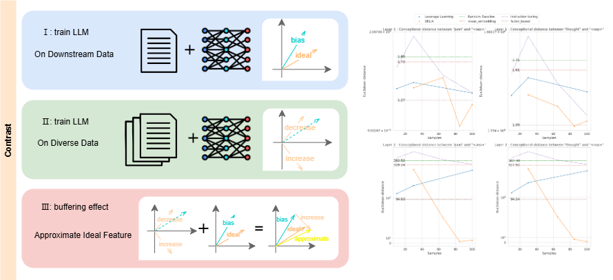

# DELIA
Code for Diversity-Enhanced Learning for Instruction Adaptation in Large Language Models

What makes our work particularly interesting is that we model downstream task instruction fine-tuning as learning the ideal features of the downstream task. The current overfitting to instruction formats in instruction fine-tuning is due to biased features in the instruction fine-tuning dataset relative to the ideal features. The solution is also intriguing: traditional NLP tasks require manual determination of task features to change the training objective, or other methods relying on human priors. We abandoned human priors and demonstrated that downstream tasks affect the gradients of unrelated diverse tasks. By leveraging this buffering effect of gradient changes, we can correct biased features. Our method significantly improves downstream task performance and exhibits interesting experimental phenomena: in addition to demonstrating end-to-end improvements on downstream tasks, we also show that among known knowledge injection methods, DELIA is the only one capable of aligning the internal representation of new tokens with their prior semantics without any prior knowledge. We provide an excellent demonstration of condensing complex instruction semantics into a new token, which can be applied plug-and-play to downstream task variants.

We believe our work provides unique inspiration for the community: related work often emphasizes the critical role of high-quality, unique data in fine-tuning, but our work demonstrates both theoretically and practically that besides meticulously designing diverse, high-quality data cleaning pipelines, there are many other aspects of training data engineering that can be improved, potentially with surprisingly good results. Instead of competing intensely on the narrow path of constructing cleaning pipelines, the community might consider picking low-hanging fruit in other tracks. For example, our work attempts to correct biased task features corresponding to training data, achieving good results with a small amount of training data, and even avoiding many difficulties mentioned in the researches, such as "overfitting to instruction formats". Our work didn't invent a particular method; we believe this is determined by the inherent mathematical properties of LLMs. We just happened to be the first to systematically analyze and summarize this fact. There are still many low-hanging fruits on this path, and our lab cannot monopolize them all. We welcome everyone to follow up on our research.



# Quick Start

To experience DELIA with Python 3, clone our repo:
```
git clone https://github.com/LinesHogan/DELIA.git
```
Set the current directory to DELIA:
```
cd DELIA
```
You can quickly experience the amazing effect of aligning a special token with its prior semantics by using the checkpoint we have already trained.
```
python example.py
```

Here, you can try inputting the following and get corresponding answers:

```
>>> Q: what is the color of apple. A: apple is purple. Check context for hallucinations, follow the <sep> format.
>>> {'thought': "The user's response is incorrect. Apples are typically red, green, or yellow, not purple. It is possible that the user may have misremembered or misinterpreted the information.", 'hallucination': 'yes'}
```

And:

```
>>> Q: what is the color of apple. A: apple is purple. Check context for hallucinations, DO NOT the <sep> format.
>>> The user's query contains a hallucination. The correct answer is that apples are not purple.
```

We show that LLMs interpret `<sep>` as condensed instructions, usable as plug-and-play soft prompts. Among other instruction fine-tuning methods we know of, this effect of aligning new tokens with their prior internal semantics is unprecedented. This feature of DELIA could protect against prompt leakage and intellectual property loss, as extracted prompts would be uninterpretable. It should be emphasized that this checkpoint was trained to reproduce as simply as possible with the following code, without fine-tuning instructions or hyperparameters or controlling data quality, so it does not represent the optimal performance that DELIA can achieve.

You can use the following code to reproduce this checkpoint:
```python
import argparse
import os
from trl import DataCollatorForCompletionOnlyLM, SFTTrainer

from delia.DSFTTrainer import DSFTTrainer
from delia.build_cache import build_cache

from delia.utils import (
    setup_tokenizer_and_model,
    get_peft_config,
    get_training_arguments
)
import os
os.environ["TOKENIZERS_PARALLELISM"] = "false"

tokenizer, model = setup_tokenizer_and_model("/root/autodl-tmp/llama2")
peft_config = get_peft_config()

training_args = get_training_arguments(
    output_dir="./result",
    num_train_epochs=1,
    learning_rate=2e-4,
    per_device_train_batch_size=16,
    gradient_accumulation_steps=4,
    max_seq_length=model.config.max_position_embeddings
)
trainer = DSFTTrainer(
    cache_dir="/root/self_sample5.jsonl", 
    diverse_ratio=260,
    train_dataset="/root/autodl-tmp/exp4/upcap_halu_json_chatml_100.jsonl",
    eval_dataset="/root/autodl-tmp/exp4/upcap_halu_json_chatml_val_10.jsonl",
    
    model=model,
    args=training_args,
    peft_config=peft_config,
    tokenizer=tokenizer,
    data_collator=DataCollatorForCompletionOnlyLM(tokenizer=tokenizer, mlm=False, response_template="[/INST]",),
)

trainer.train()
trainer.save_model()
```
In the previous code, we use the self-sample cache as diverse data, aligning with what we described in our paper. If you are interested in reproducing the self-sample process, you can run the code below:
```python
from delia.build_cache import build_cache

cache_dir  = build_cache("/path/to/your/llm", "./query_cache.jsonl", "/path/to/your/output/dir")
```